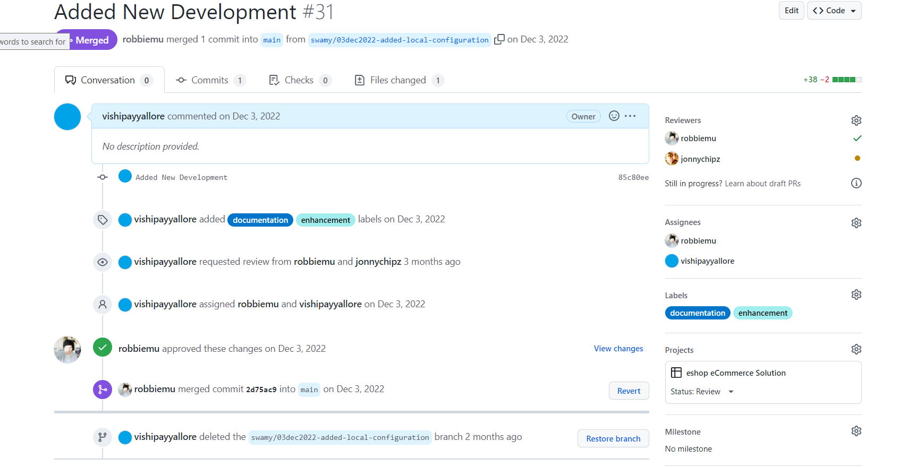
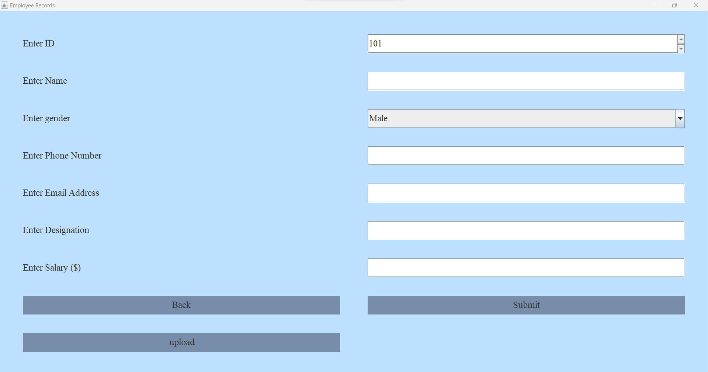
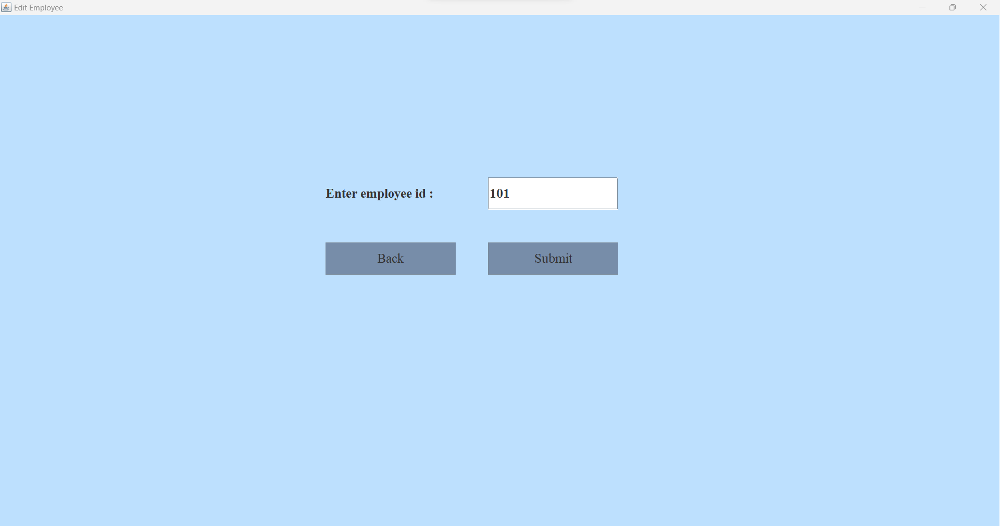
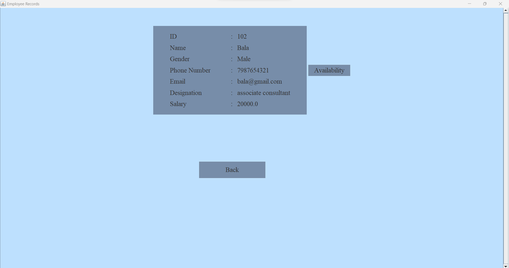

# Mangali Srinath

## Date Time:  6:30 pm Saturday, 18 March 2023 (IST)

## Java Training acquired

> 1. JAVA SWING:  Basic Understanding of Java Swing toolkit for creating desktop applications with graphical user interfaces. I have worked on few projects where I designed and developed custom UI components using swing. Worked on projects like Calculator, Digital Watch , Converters, Registration and login forms . Built an Employee management Application by Connecting to Database using JDBC Api to perform all CRUD operations.

> 2. JAVA FX: - Basic Understanding of developing desktop applications with graphical user interfaces using the JavaFX framework. I am proficient in using FXML to design user interfaces. Worked on Projects like Calculator, Registration and login forms, and worked on aggregating various components and features in the JavaFX toolkit to constantly sharpen my skillset.

>3. JAVA: Good understanding of OOPS concepts and JDBC.Currently, at a Intermediate level, constantly working to build and sharpen my skills that can contribute to overall growth.

## Pull Request process, Continues Integration and Continues Delivery
**References:**
> 1. [https://learn.microsoft.com/en-us/azure/devops/repos/git/about-pull-requests?view=azure-devops](https://learn.microsoft.com/en-us/azure/devops/repos/git/about-pull-requests?view=azure-devops)
> 1. [https://learn.microsoft.com/en-us/azure/architecture/example-scenario/apps/devops-dotnet-baseline](https://learn.microsoft.com/en-us/azure/architecture/example-scenario/apps/devops-dotnet-baseline)

## Employee Management System Using Java Swing
This is a Java Swing application for managing employee information.

It has the following functionalities:

>1. **Add employee:** Allows you to add a new employee to the system by entering their personal and employment details.  
>2. **Delete employee:** Allows you to delete an existing employee from the system.  
>3. **Update employee:** Allows you to update the personal and employment details of an existing employee.  
>4. **Display employee:** Shows a list of all employees in a JTable, with their personal and employment details.

# Classes :
The application consists of the following classes:

**EmployeeManagement:** This class is responsible for establishing a connection with a database using JDBC. Edit the EmployeeManagement.java file to provide your database details.  
**EmployeeManagementSystem:** This class contains methods for inserting, deleting, and updating employee records in the database.  
**EmployeeDetails:** This class stores the personal and employment details of a single employee.  

# Prerequisites
**MySQL database:** The application uses a MySQL database to store employee records. create a database with name `mydb` and also create tables with following sql files. The `mydb_admin.sql` file contains the SQL query to create the necessary table for login .The `mydb_employee.sql` file contains the SQL query to create the employee table.

# How to run the application : 
1. Clone the repository to your local machine.
2. Open the project in an IDE such as Eclipse.
3. Build and run the project run `EmployeeManagement.java` file.
4. The application will open in a new window. login with correct credentials and Follow the prompts to add, delete, update, or display employees.

# login

# menu

# View All Employees

# Add an Employee

# Edit an Employee

# delete an Employee

