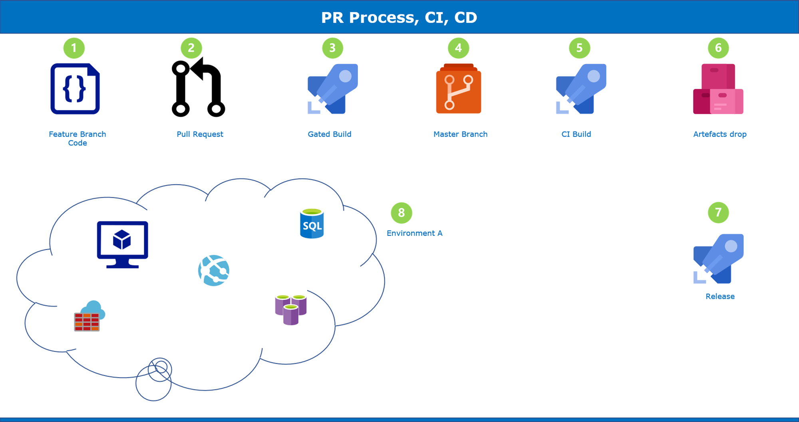

# Mangali Srinath

## Date Time:  6:30 pm Saturday, 18 March 2023 (IST)

## Java Training acquired

> 1. JAVA SWING:  Basic Understanding of Java Swing toolkit for creating desktop applications with graphical user interfaces. I have worked on few projects where I designed and developed custom UI components using swing. Worked on projects like Calculator, Digital Watch , Converters, Registration and login forms . Built an Employee management Application by Connecting to Database using JDBC Api to perform all CRUD operations.

> 2. JAVA FX: - Basic Understanding of developing desktop applications with graphical user interfaces using the JavaFX framework. I am proficient in using FXML to design user interfaces. Worked on Projects like Calculator, Registration and login forms, and worked on aggregating various components and features in the JavaFX toolkit to constantly sharpen my skillset.

>3. JAVA: Good understanding of OOPS concepts and JDBC.Currently, at a Intermediate level, constantly working to build and sharpen my skills that can contribute to overall growth.

## Pull Request process, Continues Integration and Continues Delivery
**References:**
> 1. [https://learn.microsoft.com/en-us/azure/devops/repos/git/about-pull-requests?view=azure-devops](https://learn.microsoft.com/en-us/azure/devops/repos/git/about-pull-requests?view=azure-devops)
> 1. [https://learn.microsoft.com/en-us/azure/architecture/example-scenario/apps/devops-dotnet-baseline](https://learn.microsoft.com/en-us/azure/architecture/example-scenario/apps/devops-dotnet-baseline)

## JDBC with Sqlite Console App
> 1. Topic-1
> 1. Topic-2
